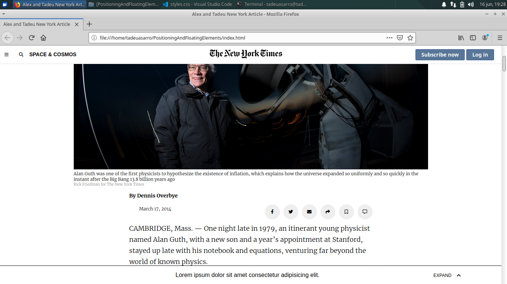

# PositioningAndFloatingElements

> This is a recreation of https://www.nytimes.com/2014/03/18/science/space/detection-of-waves-in-space-buttresses-landmark-theory-of-big-bang.html?_r=0 article page

## Built With

- HTML5 
- CSS
- Fontawesome

## Live Demo

[Live Demo Link](https://rawcdn.githack.com/tadeuasarro/PositioningAndFloatingElements/bdcf182f7771ffe6c8f2d42a81b9efa465260aeb/index.html)

## Authors

👤 **Tadeu de Abreu Sarro**

- Github: [@tadeuasarro](https://github.com/tadeuasarro)
- Twitter: [@tadeuasarro](https://twitter.com/tadeuasarro)
- Linkedin: [@tadeuasarro](https://www.linkedin.com/in/tadeu-sarro-71481013a/)

👤 **Pablo Alexis Zambrano Coral**

- Github: [@Alexoid1](https://github.com/Alexoid1)
- Twitter: [@pablo_acz](https://twitter.com/pablo_acz)
- Linkedin: [linkedin](https://www.linkedin.com/in/pablo-alexis-zambrano-coral-7a614a189/)

## 🤝 Contributing

Contributions, issues and feature requests and any type of feedback to improve are welcome!

## Show your support

Give a ⭐️ if you like this project!

## Acknowledgments

- Elements aligned with a combination of all three techniques (float, flex and grid)
- How to style a website that has more css features

## 📝 License

This project has no license.
